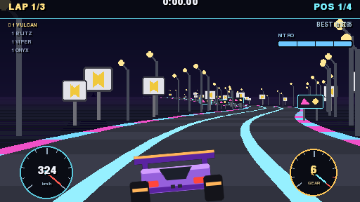
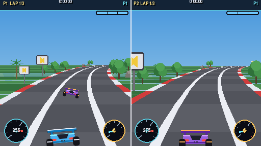

# RENGEAR

[](https://github.com/Renan2010p/rengear/actions/workflows/ci.yml)
[](LICENSE)

> **An RL PROJECTS game.** A *Top Gear*-style arcade racer — built on the
> classic **trick of the tracks**: a flat list of road segments, two numbers
> each, projected into a pseudo-3D world. Prototyped in Python + pygame.

RENGEAR is a no-assets, pure-code homage to the 16-bit racers: pick a car and
a country, race three laps against rivals, use nitro, chase your best lap — or
go head to head in **local split screen**. Every pixel and every sound is
generated by the code at runtime; there are no image or audio files anywhere.




> **100% original work.** All cars, names, tracks, artwork and audio are
> created by this project's code and are not derived from — or affiliated
> with — any existing commercial game. See [docs/LEGAL.md](docs/LEGAL.md).

## The trick of the tracks

A track is not a mesh: it is a **list of segments**. Each segment carries just
two numbers that create every illusion:

- a **`curve`** value (bends the road left/right), and
- a world **`y`** (makes hills).

Every frame the segments ahead are projected with one perspective divide
(`scale = depth / z`) and painted back-to-front as flat trapezoids. The camera
never turns: curves are faked by accumulating a horizontal offset
(`x += dx; dx += curve`), and hills simply move each projected line up or down.
That is the whole renderer — see [docs/ARCHITECTURE.md](docs/ARCHITECTURE.md).

## Highlights

- **The pseudo-3D road trick** — segments, curves, hills, fog and roadside
  props, written from scratch in [`rengear/game/road.py`](rengear/game/road.py).
- **Six tracks** with distinct palettes and scenery — coast, canyon, forest,
  desert, neon city and polar ridge.
- **Four cars** with real handling differences (power, top speed, grip, nitro).
- **A Top Gear-style dashboard** — analog speedometer and tachometer with
  needles, a six-speed automatic box with a rev limiter, lap/time/position and
  nitro.
- **Cars that turn** — the player's car leans with the steering and rival cars
  bank through corners.
- **Three rival AI cars** with skill, curve braking and lane behaviour.
- **Local 2-player split screen** — a vertical split where each player has
  their own camera, car, gearbox and dashboard, head to head over three laps.
- **Arcade race rules** — countdown, three laps, live position, lap and best
  lap times, nitro boost, off-road penalties and collisions.
- **Procedural art & audio** generated at runtime — zero third-party assets.
- **Split engine / game layers** with a **platform seam**
  ([`rengear/engine/platform`](rengear/engine/platform)) so a future port only
  swaps the backend.
- **Data-driven content** — a track is a script, a car is a dict; see
  [docs/TRACKS.md](docs/TRACKS.md).

## Running

```bash
python -m pip install -r requirements.txt
python main.py
```

Requires **Python 3.10+** and **pygame 2.1+**.

## Controls

| Action            | Keys                          |
|-------------------|-------------------------------|
| Steer             | Left/Right arrows / A / D     |
| Accelerate        | Up arrow / W                  |
| Brake             | Down arrow / S                |
| Nitro             | Z / Space                     |
| Pause             | Enter / Esc / P               |
| Restart race      | R                             |
| Confirm / menu    | Enter / Z / Space             |
| Back              | Esc / X                       |

### Two players (split screen)

Pick **2 PLAYERS** on the title, choose both cars on the setup screen, then:

| Action      | Player 1 (left) | Player 2 (right) |
|-------------|-----------------|------------------|
| Steer       | ← / →           | A / D            |
| Accelerate  | ↑               | W                |
| Brake       | ↓               | S                |
| Nitro       | Z               | C                |

## Project layout

```
main.py                     entry point
rengear/rlprojects.py       studio identity + the roadmap
rengear/engine/             reusable, game-agnostic engine
  platform/                 THE SEAM: backend contract + pygame backend
  app.py                    fixed-step loop and shared services
  scene.py                  scene stack with fades
  input.py / ui.py          semantic actions, immediate-mode UI
  audio.py / save.py        procedural audio, JSON persistence
  registry.py / sprites.py  content registry, surface helpers
rengear/game/               content and rules
  config.py                 constants, palette, cars, track themes
  tracks.py                 the editable track piece scripts
  road.py                   the pseudo-3D road trick
  car.py                    player physics + rival AI
  art.py                    procedural sprites (cars, props, effects)
  scenes/                   splash, title, choose, race, pause, results
docs/                       architecture, tracks, porting and legal guides
tests/                      headless unit tests
tools/                      headless smoke test
```

## Development stages

| Stage | Tech              | Purpose                                            |
|-------|-------------------|----------------------------------------------------|
| 1     | Python + pygame   | Prototype: find the game fast *(this repository)*  |
| 2     | Zig + Neko engine | Rewrite: share the studio's engine                 |
| 3     | all platforms     | Release: Linux, Windows, macOS, web and consoles   |

The **one rule** that keeps stage 2 cheap: game logic never touches the
platform. It uses logical keys/events from `rengear/engine/platform`; only the
backend changes on a port. See [docs/PORTING.md](docs/PORTING.md).

## Documentation

- [docs/ARCHITECTURE.md](docs/ARCHITECTURE.md) — how the engine and game fit together.
- [docs/TRACKS.md](docs/TRACKS.md) — add a track or a car.
- [docs/BUILD.md](docs/BUILD.md) — package a release and how the workflows work.
- [docs/PORTING.md](docs/PORTING.md) — the platform seam and a port checklist.
- [docs/LEGAL.md](docs/LEGAL.md) — how the project stays original.
- [CONTRIBUTING.md](CONTRIBUTING.md) — how to help. [CHANGELOG.md](CHANGELOG.md) — release notes.

## Tests and tools

```bash
python -m tests.test_engine     # headless unit + integration tests
python -m tools.smoke           # drive one race with an autopilot
python -m tools.smoke --split   # drive one two-player race
python -m tools.render_frame    # save a PNG frame (no display needed)
python -m tools.package         # build rengear-<platform>.zip (needs PyInstaller)
```

## Building and releases

There is nothing to compile — but you can build a self-contained package:

```bash
python -m pip install pyinstaller
python -m tools.package         # -> rengear-linux-x64.zip / rengear-windows-x64.zip
```

Pushing a tag like `v0.1.0` runs
[`.github/workflows/release.yml`](.github/workflows/release.yml), which builds
the Windows and Linux zips and attaches them to a GitHub Release. See
[docs/BUILD.md](docs/BUILD.md) for details.

## License

RENGEAR is free software licensed under the **GNU General Public License,
version 3 or later**. See [LICENSE](LICENSE).

```
Copyright (C) 2026 RENGEAR contributors

This program is free software: you can redistribute it and/or modify it under
the terms of the GNU General Public License as published by the Free Software
Foundation, either version 3 of the License, or (at your option) any later
version.
```
